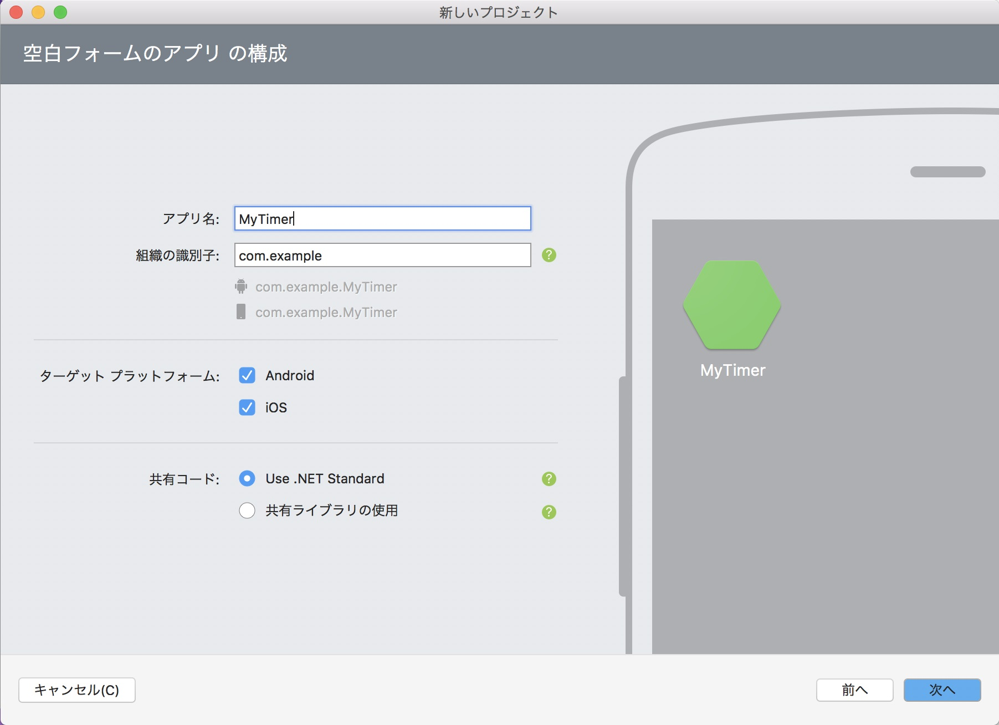

# プロジェクトの新規作成
Xamarin.Forms のプロジェクト(ソリューション)を新規作成します。  
プロジェクト名は「MyTimer」で作成します。  
  
## Mac の場合
・[新しいプロジェクト] ボタンをクリックします。  
  

・[新しいプロジェクト] ウィンドウで [ マルチプラットフォーム > Xamarin.Forms 空白のアプリ C# ] を選択し、[次へ] をクリックします。  
  

・[アプリ名:] に ```MyTimer``` と入力します。[組織の識別子:] に世界で一意となりそうな文字列を設定します。[com.{あなたのハンドル}{今日の日付}] などとしておきます。  
・[次へ] をクリックします。  
  

・[プロジェクト名:] および [ソリューション名:] に ```MyTimer``` と入力し [作成] をクリックします。  
※[場所:] は好きな場所を選択してください。
  

## Windows の場合
・メニューの [ ファイル > 新規作成 > プロジェクト ] を選択します。  
  

・[新しいプロジェクト] ウィンドウで [ Visual C# > Cross-Platform > Mobile App (Xamarin.Forms) ] を選択します。  
・[名前:] に ```MyTimer``` と入力し [OK] をクリックします。  
※[場所:] は浅い階層のディレクトリで好きな場所を選択してください。**パスが短くないとビルドに失敗することがあります。**
  

・[New Cross Platform App - MyTimer] ウィンドウで [Select a template:] で [Blank App] を選択します。  
・[Platform] は [Android] と [iOS] をチェックし[Windows (UWP)]
 はチェックを外します。  
 ・[Code Sharing Strategy] は [.NET Standard] を選択し、[OK] を クリックします。
  

## ヒント
Android プロジェクトのビルドに失敗する場合  
- NuGet パッケージの復元
- NuGet パッケージの更新
- プロジェクトのクリーン
- 最小 Android バージョンの設定をレベル19以上などに変更

などを試してください。

[< 前ページ](../readme.md) | [次ページ >](./textbook02.md)  