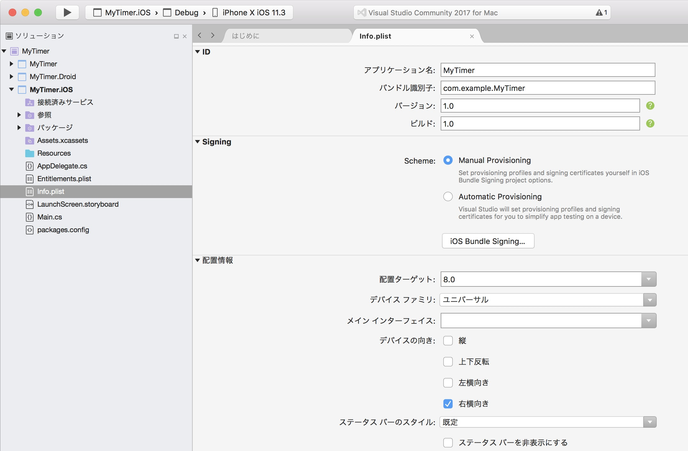
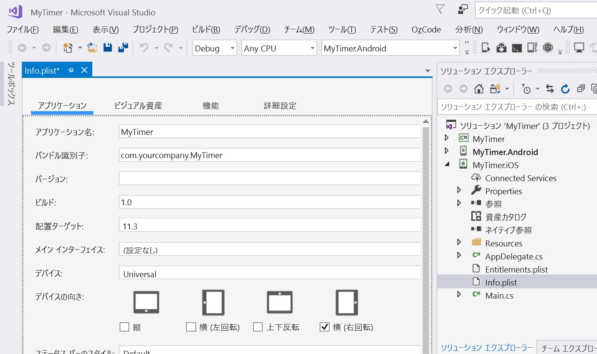

# 横画面表示固定の設定
今回作成するアプリは画面の回転に対応しない横画面固定のアプリです。  
アプリはどのようなサイズ、縦横比の画面でも使用可能であること望ましいですが、今回は簡略化のためスマートフォンの横画面のみを考えて実装します。  

## iOS の設定 (Mac の場合)
・ソリューションエクスプローラー上で、[MyTimer.iOS > info.plist] をダブルクリックします。  
・[配置情報 > デバイスの向き] で [右横向き] だけをチェックし [縦]・[上下反転]・[左横向き] のチェックを外します。  


## iOS の設定 (Windows の場合)
・ソリューションエクスプローラー上で、[MyTimer.iOS > info.plist] をダブルクリックします。  
・[アプリケーション > デバイスの向き:] で [横(右回転)] だけをチェックし [縦]・[横(左回転)]・[上下反転] のチェックを外します。  


## Android の設定
**Mac の場合**  
・ソリューションエクスプローラー上で、[MyTimer.Droid > MainActivity.cs] をダブルクリックします。  
  
**Windows の場合**  
・ソリューションエクスプローラー上で、[MyTimer.Android > MainActivity.cs] をダブルクリックします。  
  
**Mac・Windows 共通**  
・```MainActivity``` クラスの属性に
```cs
, ScreenOrientation =ScreenOrientation.Landscape
```
を追加します。  

追加後のソースコードは次のようになります。
```cs
using System;

using Android.App;
using Android.Content.PM;
using Android.Runtime;
using Android.Views;
using Android.Widget;
using Android.OS;

namespace MyTimer.Droid
{
    [Activity(Label = "MyTimer", Icon = "@drawable/icon", Theme = "@style/MainTheme", MainLauncher = true, ConfigurationChanges = ConfigChanges.ScreenSize | ConfigChanges.Orientation, ScreenOrientation = ScreenOrientation.Landscape)]
    public class MainActivity : global::Xamarin.Forms.Platform.Android.FormsAppCompatActivity
    {
        protected override void OnCreate(Bundle bundle)
        {
            TabLayoutResource = Resource.Layout.Tabbar;
            ToolbarResource = Resource.Layout.Toolbar;

            base.OnCreate(bundle);

            global::Xamarin.Forms.Forms.Init(this, bundle);
            LoadApplication(new App());
        }
    }
}
```

[< 前ページ](./textbook01.md) | [次ページ >](./textbook03.md)  