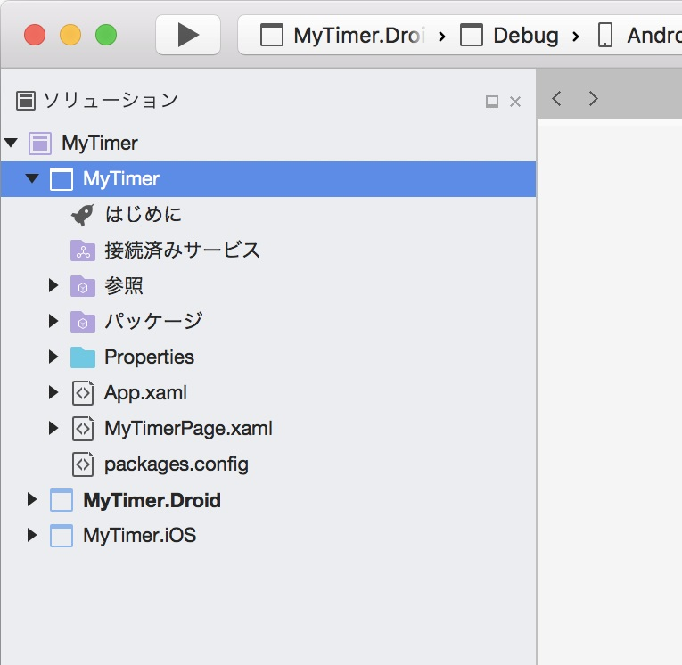
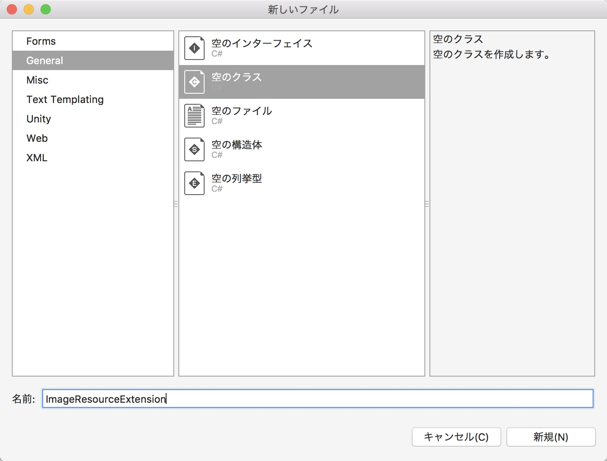
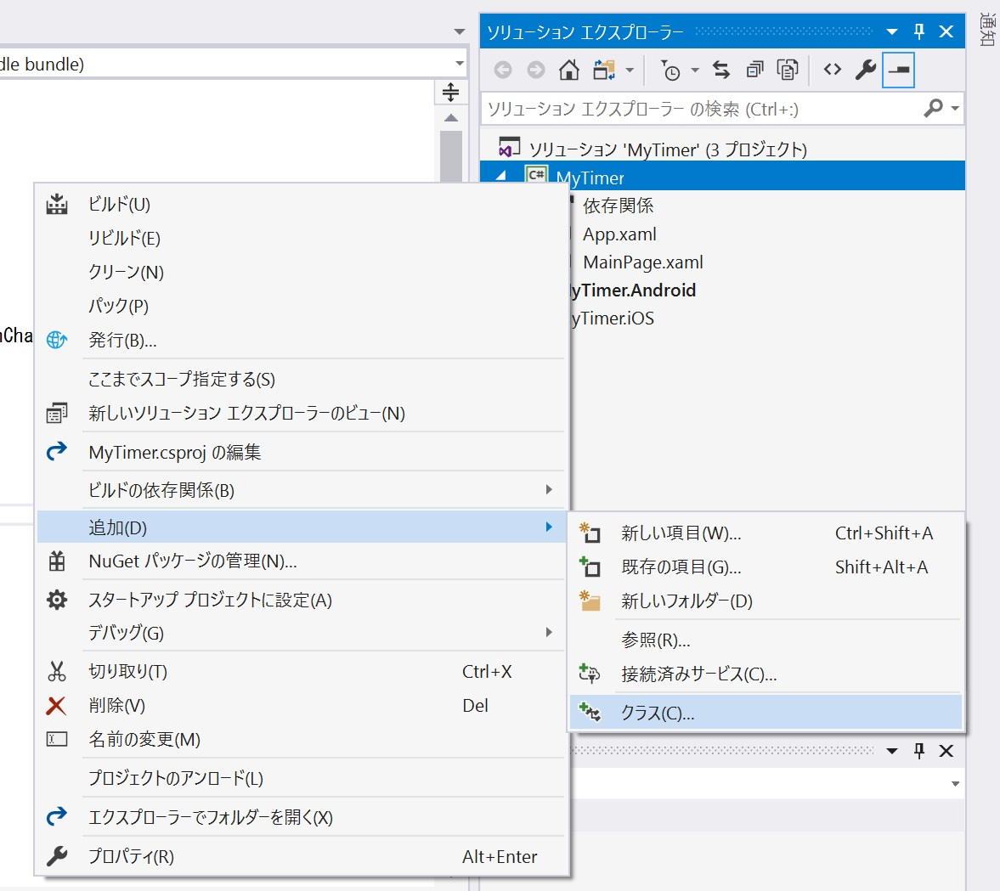
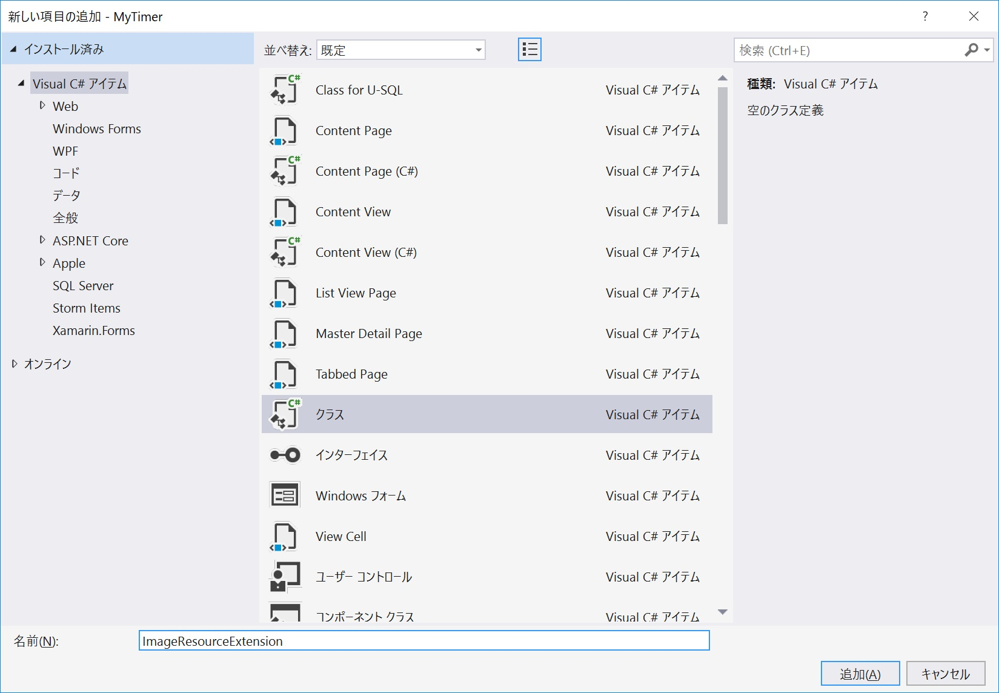
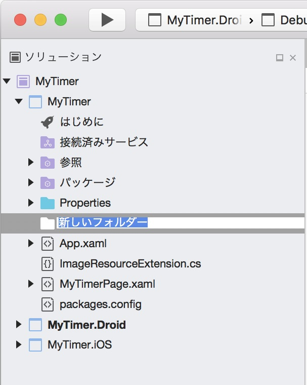
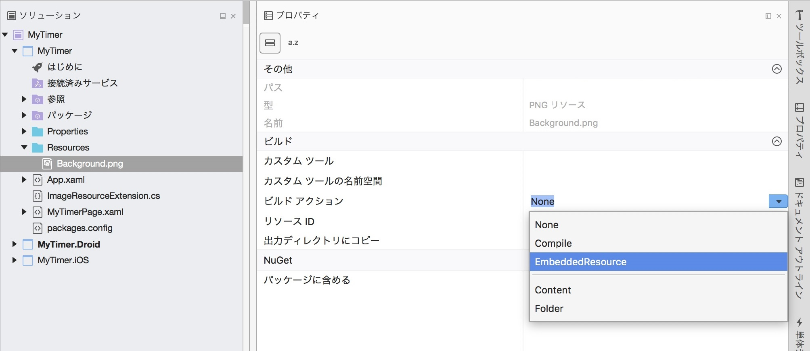
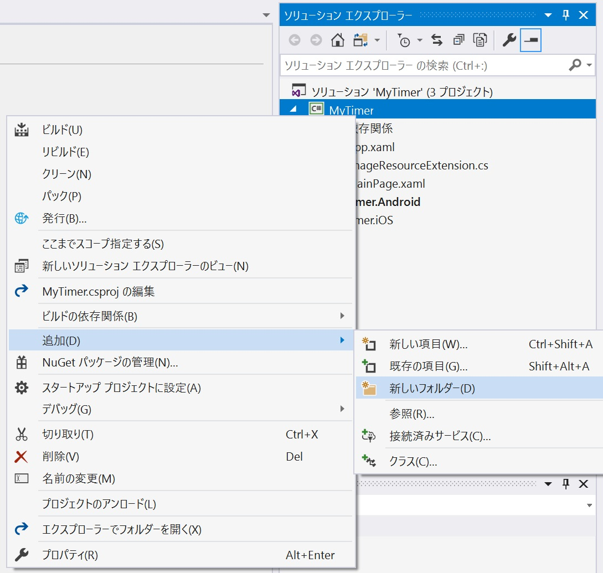
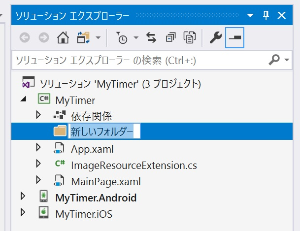
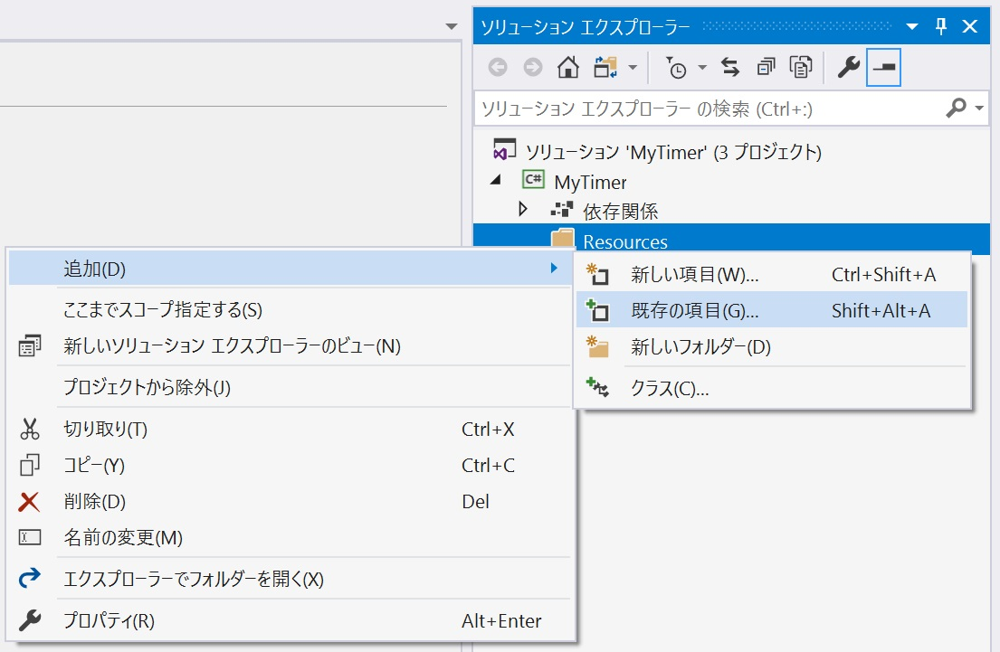
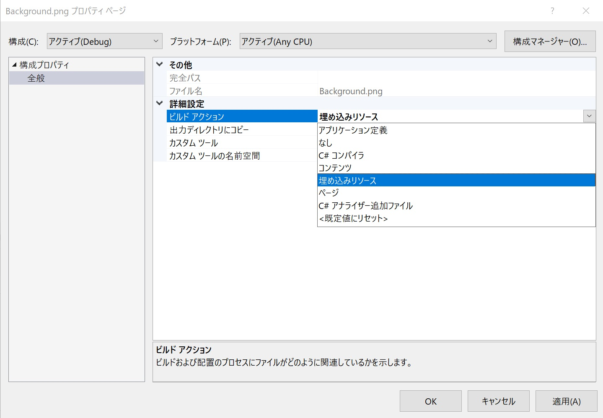

# 背景画像の表示
画面の背景に画像を表示します。  
画像ファイルは本来であればプラットフォーム毎のリソースファイルを用意することが望ましいですが、今回は画像ファイルも共通化する手法で実装します。  
  
## ImageResourceExtension クラス
画像ファイルを共通化するには、 **IMarkupExtension** インタフェースを実装した XAML の独自拡張機能クラスを作成します。

## クラスの新規作成 (Mac の場合)
・ソリューションエクスプローラー上の [MyTimer] 上で二本指タップ (右クリック) します。  


・[追加 > 新しいファイル] を選択します。  
・[新しいファイル] ウィンドウで [General > 空のクラス] を選択します。  
・[名前:] に ```ImageResourceExtension``` と入力します。  
・[新規] をクリックします。  


## クラスの新規作成 (Windows の場合)
・ソリューションエクスプローラー上の [MyTimer] 上で二本指タップ (右クリック) します。  
・[追加 > クラス] を選択します。  


・[新しい項目の追加 - MyTimer] ウィンドウで [[名前:] に ```ImageResourceExtension``` と入力します。  
・[追加] をクリックします。  


## Mac・Windows 共通
このクラスの追加操作はこれから何度も行います。  
ここで覚えてしまうか、このページを開いておき随時参照できるようにしておいてください。

## ImageResourceExtension クラスの実装
クラスファイルの中身を次のように書き換えます。  
「**// リソースから指定のパスの画像を読み込む**」というコメントの箇所を変更することで様々な拡張機能を作成できます。  
今回はこの 1 クラスしか作成しませんが、このコードは定型コードとして覚えてしまうかメモをして置きましょう。
```cs
using System;
using System.Collections.Generic;
using System.Text;
using Xamarin.Forms;
using Xamarin.Forms.Xaml;

namespace MyTimer
{
    // 共通プロジェクトのリソース画像を表示のためのマークアップ拡張
    [ContentProperty("Source")]
    public class ImageResourceExtension : IMarkupExtension
    {
        // リソースファイルのパスを取得または設定する
        public string Source { get; set; }

        // Source で指定されたリソース画像を取得する
        public object ProvideValue(IServiceProvider serviceProvider)
        {
            if (Source == null)
                return null;
            // リソースから指定のパスの画像を読み込む
            var imageSource = ImageSource.FromResource(Source);

            return imageSource;
        }
    }
}
```

## 画像ファイルの準備
背景画像ファイルをプロジェクトに追加します。  
・次のファイルをダウンロードします。  
  
[背景画像ファイル](./resources/Background.png)  

## 画像のプロジェクトへの追加 (Mac の場合)
・ソリューションエクスプローラー上の [MyTimer] 上で二本指タップ (右クリック) します。  


・[追加 > 新しいフォルダー] を選択します。  
・フォルダー名の入力モードになるので ```Resources``` と入力します。  


・ソリューションエクスプローラー上の作成した ```Resources``` フォルダー上で二本指タップ (右クリック) します。  
・[追加 > ファイルを追加] を選択します。  
・ダウンロードした [背景画像ファイル(Background.png)] を選択し [開く] をクリックします。  
・[ファイルをフォルダーに追加する] ウィンドウで [ファイルをディレクトリにコピー します] を選択し [OK] をクリックします。  
・ソリューションエクスプローラー上の追加した [背景画像ファイル(Background.png)] 上で二本指タップ(右クリック)します。  
・[プロパティ] を選択します。  
・プロパティウィンドウ上の [ビルド > ビルド アクション] で [EmbeddedResource] を選択します。  


## 画像のプロジェクトへの追加 (Windows の場合)
・ソリューションエクスプローラー上の [MyTimer] 上で二本指タップ(右クリック)します。  
・[追加 > 新しいフォルダー] を選択します。  


・フォルダー名の入力モードになるので ```Resources``` と入力します。  


・ソリューションエクスプローラー上の作成した ```Resources``` フォルダー上で二本指タップ (右クリック) します。  
・[追加 > 既存の項目] を選択します。  


・ダウンロードした [背景画像ファイル(Background.png)] を選択し [追加] をクリックします。  
**※ファイルの種類を、[イメージ ファイル] または [すべてのファイル] にする必要がある事に注意してください。**  
・ソリューションエクスプローラー上の追加した [背景画像ファイル(Background.png)] 上で二本指タップ (右クリック) します。  
・[プロパティ] を選択します。  
・プロパティウィンドウ上の [詳細設定 > ビルド アクション] で [埋め込みリソース] を選択し [OK] をクリックします。  


## 音声ファイルの追加
今回のアプリでは、音声ファイルも同様にリソースとして埋め込み使用します。  
同じ手順になるので、ここで追加しておきます。  

[音声ファイル](./resources/voice.m4a)  

[ビルド アクション] の設定を忘れずに行ってください。  
```Resources``` フォルダには
- Background.png
- voice.m4a  

の二つのファイルがある状態になります。

## 背景画像の設定
画面の背景に画像を表示するために ```MainPage.xaml``` ファイルを編集します。  
```ContentPage``` 要素に ```xmlns:local``` 属性を追加し ```ContentPage.Content``` 要素内に ```Image``` 要素を追加します。  
今回は次のコードで ```MainPage.xaml``` ファイルの内容を上書きしてください。  
```xml
<?xml version="1.0" encoding="utf-8" ?>
<ContentPage xmlns="http://xamarin.com/schemas/2014/forms"
             xmlns:x="http://schemas.microsoft.com/winfx/2009/xaml"
             xmlns:local="clr-namespace:MyTimer"
             x:Class="MyTimer.MainPage"
             xmlns:vm="clr-namespace:MyTimer"
             Title="オリジナルタイマーアプリ">
    <!-- ページの表示内容 -->
    <ContentPage.Content>
        <Grid>
            <!-- 背景画像 -->
            <Image Source="{local:ImageResource MyTimer.Resources.Background.png}" Aspect="AspectFit" />
        </Grid>
    </ContentPage.Content>
</ContentPage>
```

## 確認
デバッグ実行し、次のように表示されたらこのステップは完了です。  

  
[< 前ページ](./textbook02.md) | [次ページ >](./textbook04.md)  