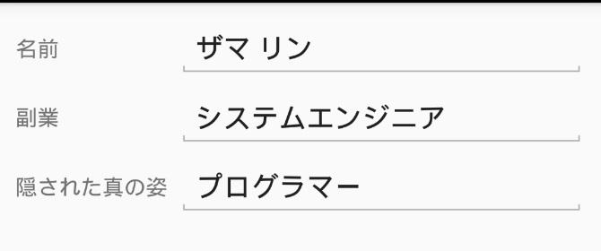

# コントロールの説明
今回のアプリで使う画面コントロールを説明します。  
  
## Label
編集不可のテキストを表示します。  
アプリのコンテンツ表示の基本でありどのようなアプリでもほぼ必須となるコントロールです。  

## Button
タップできるテキストを表示します。  
OS によっては押せるボタンのような見た目や効果が付きます。  
ユーザーによる機能起動に使用します。  

## Entry
編集可能のテキストを表示します。  
ユーザーによる文字入力機能に使用します。  

## Switch
ON または OFF を表現します。  
タップによって ON / OFF を切り替えることができます。  
ユーザーによる機能の選択に使用します。  

## StackLayout
複数の子コントロールをレイアウトして表示します。  
子コントロールを縦一列または横一列に並べて表示します。  
スマートデバイスのアプリでは、情報を縦に並べて表示する機会が多く非常に出番の多いコントロールです。  

## Grid
複数の子コントロールをレイアウトして表示します。  
自身を複数の行および列の領域に区切り、子要素毎にどの領域に表示するかを設定できます。  
うまく使うと、表示するコンテンツやデバイスの画面サイズに応じて**柔軟**に**いい感じ**の表示になるレイアウトを構築できる非常に強力なコントロールです。  
例えば次の例では、入力内容の名前の長さが変わっても文字入力欄の位置がそろいます。  

**名前が短い**  

**名前が長い**  

次ページでこれらのコントロールを使用して UI を作成します。  
  
[< 前ページ](./textbook03.md) | [次ページ >](./textbook05.md)  