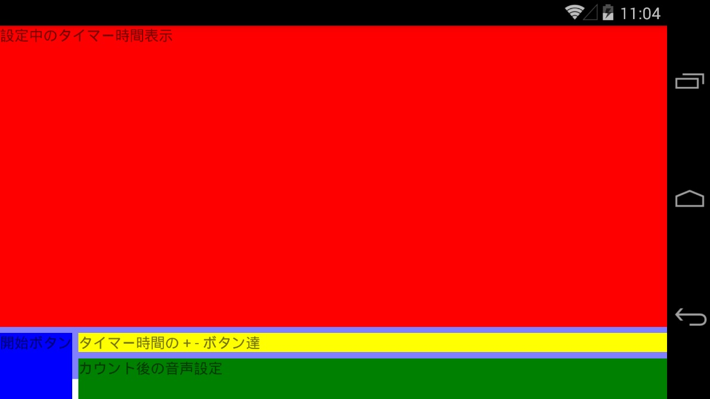
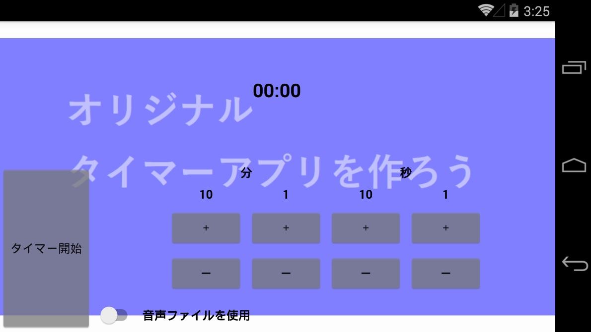

# メインページの作成
メインページの UI を作成します。  
  
## 使用コントロール
前ページで紹介したコントロールを使用して UI を作成します。  
```Grid``` と ```StackLayout``` を使用してレイアウトしています。  
後日お時間のある時にゆっくり確認してください。  

## Grid によるレイアウト
```Grid``` は ```<Grid.RowDefinitions>``` 要素の子要素 ```<RowDefinition/>``` で行を定義します。子要素 ```<RowDefinition/>``` の数がレイアウトの持つ行の数になります。  
列は ```<Grid.ColumnDefinitions>``` 要素の子要素 ```<ColumnDefinition/>``` で定義します。  

```Grid``` 内にレイアウトされる要素はその行および列の位置を ```Grid.Row``` プロパティおよび ```Grid.Column``` プロパティで設定します。  
この際、一番目の行や列にレイアウトする場合はプロパティの設定を省略できます。  
また、行や列を二つ分以上使ったサイズでレイアウトする場合は、その使う行数および列数を ```Grid.ColumnSpan``` および ```Grid.RowSpan``` プロパティで設定します。

## その他のレイアウトプロパティ

- HorizontalOptions

要素の横位置を設定します。```Start``` で左寄せに、```Center``` で中央寄せに、```End``` で右寄せにレイアウトされます。```Fill``` はその要素が使える範囲を埋めつくすようにレイアウトされます。

- VerticalOptions

要素の縦位置を設定します。```Start``` で上寄せ、```Center``` で中央寄せ、```End``` で下寄せにレイアウトされます。```Fill``` はその要素が使える範囲を埋めつくすようにレイアウトされます。

- BackgroundColor

背景色を設定します。色の名前やコードによる指定が可能です。

## XAML の編集
```MainPage.xaml``` ファイルを編集します。 
今回は次のコードで ```MainPage.xaml``` ファイルの内容を上書きしてください。
```xml
<?xml version="1.0" encoding="utf-8" ?>
<ContentPage xmlns="http://xamarin.com/schemas/2014/forms"
             xmlns:x="http://schemas.microsoft.com/winfx/2009/xaml"
             xmlns:local="clr-namespace:MyTimer"
             x:Class="MyTimer.MainPage"
             xmlns:vm="clr-namespace:MyTimer"
             Title="オリジナルタイマーアプリ">
    <!-- ページの表示内容 -->
    <ContentPage.Content>
        <Grid>
            <!-- 背景画像 -->
            <Image Source="{local:ImageResource MyTimer.Resources.Background.png}" Aspect="AspectFit" />

            <Grid BackgroundColor="#80FFFFFF">
                <Grid.RowDefinitions>
                    <RowDefinition Height="*"/>
                    <RowDefinition Height="Auto"/>
                    <RowDefinition Height="40"/>
                </Grid.RowDefinitions>
                <Grid.ColumnDefinitions>
                    <ColumnDefinition Width="Auto"/>
                    <ColumnDefinition Width="*"/>
                </Grid.ColumnDefinitions>

                <!-- 設定中のタイマー時間表示 -->
                <Label Text="設定中のタイマー時間表示"
                       Grid.ColumnSpan="2"
                       HorizontalOptions="Fill" VerticalOptions="Fill"
                       BackgroundColor="Red"/>

                <!-- タイマー開始ボタン -->
                <Label Text="開始ボタン"
                       Grid.Row="1" Grid.RowSpan="2"
                       HorizontalOptions="Fill" VerticalOptions="Fill"
                       BackgroundColor="Blue"/>

                <!-- タイマー時間の + - ボタン達 -->
                <Label Text="タイマー時間の + - ボタン達"
                       Grid.Row="1" Grid.Column="1"
                       HorizontalOptions="Fill" VerticalOptions="Fill"
                       BackgroundColor="Yellow"/>

                <!-- カウント後の音声設定 -->
                <Label Text="カウント後の音声設定"
                       Grid.Row="2" Grid.Column="1"
                       HorizontalOptions="Fill" VerticalOptions="Fill"
                       BackgroundColor="Green"/>
            </Grid>
        </Grid>
    </ContentPage.Content>
</ContentPage>
```

## 実行
実行をして確認してみます。次のように表示されれば OK です。  


**・レイアウトの構造**  
赤いラベルは、1 行目の 1～2 列目の領域にレイアウトされています。  
青いラベルは、2～3 行目の 1 列目の領域にレイアウトされています。  
黄色は、2 行目の 2 列目。緑は、3 行目の 2 列目にレイアウトされています。

## StackLayout によるレイアウト
```StackLayout``` 内部にレイアウトされる要素を縦一列または横一列に並べます。並べる方向は、```Orientation``` プロパティで設定します。  
```Horizontal``` の場合、横一列に並べます。  
```Vertical``` の場合、縦一列に並べます。デフォルト値は ```Vertical``` になっているため縦に並べる場合はプロパティを省略できます。  
```Grid``` の各領域の内容を ```StackLayout``` を活用しながらレイアウトします。  

**・設定中のタイマー時間表示**  
```xml
 <!-- 設定中のタイマー時間表示 -->
 <Label Text="設定中のタイマー時間表示"
        Grid.ColumnSpan="2"
        HorizontalOptions="Fill" VerticalOptions="Fill"
        BackgroundColor="Red"/>
```
を
```xml
<!-- 設定中のタイマー時間表示 -->
<Label Text="00:00"
    Grid.ColumnSpan="2"
    HorizontalOptions="Center" VerticalOptions="Center"
    FontSize="Large" TextColor="Black" FontAttributes="Bold"/>
```
と書き換えます。  

**・タイマー開始ボタン**
```xml
 <!-- タイマー開始ボタン -->
 <Label Text="開始ボタン"
        Grid.Row="1" Grid.RowSpan="2"
        HorizontalOptions="Fill" VerticalOptions="Fill"
        BackgroundColor="Blue"/>
```
を
```xml
<!-- タイマー開始ボタン -->
<Button Text="タイマー開始"
    Grid.Row="1" Grid.RowSpan="2"
    BackgroundColor="#80808080"/>
```
と書き換えます。  

**・タイマー時間の + - ボタン達**
```xml
<!-- タイマー時間の + - ボタン達 -->
<Label Text="タイマー時間の + - ボタン達"
       Grid.Row="1" Grid.Column="1"
       HorizontalOptions="Fill" VerticalOptions="Fill"
       BackgroundColor="Yellow"/>
```
を
```xml
<!-- タイマー時間の + - ボタン達 -->
<StackLayout Orientation="Horizontal"
    Grid.Row="1" Grid.Column="1"
    HorizontalOptions="Center">
    <!-- 分の + - ボタン達 -->
    <StackLayout>
        <!-- 「分」 ラベル -->
        <Label Text="分" HorizontalOptions="Center" TextColor="Black" FontAttributes="Bold"/>
        <!-- + - ボタン達  -->
        <StackLayout Orientation="Horizontal">
            <!-- 10の位設定 -->
            <StackLayout>
                <Label Text="10" HorizontalOptions="Center" TextColor="Black" FontAttributes="Bold"/>
                <Button Text="＋" BackgroundColor="#80808080"/>
                <Button Text="ー" BackgroundColor="#80808080"/>
            </StackLayout>
            <!-- 1の位設定 -->
            <StackLayout>
                <Label Text="1" HorizontalOptions="Center" TextColor="Black" FontAttributes="Bold"/>
                <Button Text="＋" BackgroundColor="#80808080"/>
                <Button Text="ー" BackgroundColor="#80808080"/>
            </StackLayout>
        </StackLayout>
    </StackLayout>
    <!-- 秒の + - ボタン達 -->
    <StackLayout>
        <!-- 「秒」 ラベル -->
        <Label Text="秒" HorizontalOptions="Center" TextColor="Black" FontAttributes="Bold"/>
        <!-- + - ボタン達  -->
        <StackLayout Orientation="Horizontal">
            <!-- 10の位設定 -->
            <StackLayout>
                <Label Text="10" HorizontalOptions="Center" TextColor="Black" FontAttributes="Bold"/>
                <Button Text="＋" BackgroundColor="#80808080"/>
                <Button Text="ー" BackgroundColor="#80808080"/>
            </StackLayout>
            <!-- 1の位設定 -->
            <StackLayout>
                <Label Text="1" HorizontalOptions="Center" TextColor="Black" FontAttributes="Bold"/>
                <Button Text="＋" BackgroundColor="#80808080"/>
                <Button Text="ー" BackgroundColor="#80808080"/>
            </StackLayout>
        </StackLayout>
    </StackLayout>
</StackLayout>
```
と書き換えます。  

**・カウント後の音声設定**
```xml
<!-- カウント後の音声設定 -->
<Label Text="カウント後の音声設定"
       Grid.Row="2" Grid.Column="1"
       HorizontalOptions="Fill" VerticalOptions="Fill"
       BackgroundColor="Green"/>
```
を
```xml
<!-- カウント後の音声設定 -->
<Grid Grid.Row="2" Grid.Column="1">
    <Grid.ColumnDefinitions>
        <ColumnDefinition Width="Auto"/>
        <ColumnDefinition Width="*"/>
    </Grid.ColumnDefinitions>
    <!-- テキスト読み上げ or 音声ファイル の選択 Switch -->
    <Switch x:Name="useSpeechText"/>
    <Grid Grid.Column="1">
        <!-- 音声ファイルを使用ラベル -->
        <Label Text="音声ファイルを使用"
            HorizontalOptions="Fill" VerticalOptions="Center" HorizontalTextAlignment="Start"
            TextColor="Black" FontAttributes="Bold"/>
        <!-- テキスト読み上げのテキスト -->
        <Editor
            HorizontalOptions="Fill"
            IsVisible="{Binding IsToggled, Source={x:Reference useSpeechText}" BackgroundColor="White"/>
    </Grid>
</Grid>
```
と書き換えます。  

## 現在のコード
ここまでの手順を終えた現在の ```MainPage.xaml``` は次のようになっています。
```xml
<?xml version="1.0" encoding="utf-8" ?>
<ContentPage xmlns="http://xamarin.com/schemas/2014/forms"
             xmlns:x="http://schemas.microsoft.com/winfx/2009/xaml"
             xmlns:local="clr-namespace:MyTimer"
             x:Class="MyTimer.MainPage"
             xmlns:vm="clr-namespace:MyTimer"
             Title="オリジナルタイマーアプリ">
    <!-- ページの表示内容 -->
    <ContentPage.Content>
        <Grid>
            <!-- 背景画像 -->
            <Image Source="{local:ImageResource MyTimer.Resources.Background.png}" Aspect="AspectFit" />

            <Grid BackgroundColor="#80FFFFFF">
                <Grid.RowDefinitions>
                    <RowDefinition Height="*"/>
                    <RowDefinition Height="Auto"/>
                    <RowDefinition Height="40"/>
                </Grid.RowDefinitions>
                <Grid.ColumnDefinitions>
                    <ColumnDefinition Width="Auto"/>
                    <ColumnDefinition Width="*"/>
                </Grid.ColumnDefinitions>

                <!-- 設定中のタイマー時間表示 -->
                <Label Text="00:00"
                    Grid.ColumnSpan="2"
                    HorizontalOptions="Center" VerticalOptions="Center"
                    FontSize="Large" TextColor="Black" FontAttributes="Bold"/>

                <!-- タイマー開始ボタン -->
                <Button Text="タイマー開始"
                    Grid.Row="1" Grid.RowSpan="2"
                    BackgroundColor="#80808080"/>

                <!-- タイマー時間の + - ボタン達 -->
                <StackLayout Orientation="Horizontal"
                    Grid.Row="1" Grid.Column="1"
                    HorizontalOptions="Center">
                    <!-- 分の + - ボタン達 -->
                    <StackLayout>
                        <!-- 「分」 ラベル -->
                        <Label Text="分" HorizontalOptions="Center" TextColor="Black" FontAttributes="Bold"/>
                        <!-- + - ボタン達  -->
                        <StackLayout Orientation="Horizontal">
                            <!-- 10の位設定 -->
                            <StackLayout>
                                <Label Text="10" HorizontalOptions="Center" TextColor="Black" FontAttributes="Bold"/>
                                <Button Text="＋" BackgroundColor="#80808080"/>
                                <Button Text="ー" BackgroundColor="#80808080"/>
                            </StackLayout>
                            <!-- 1の位設定 -->
                            <StackLayout>
                                <Label Text="1" HorizontalOptions="Center" TextColor="Black" FontAttributes="Bold"/>
                                <Button Text="＋" BackgroundColor="#80808080"/>
                                <Button Text="ー" BackgroundColor="#80808080"/>
                            </StackLayout>
                        </StackLayout>
                    </StackLayout>
                    <!-- 秒の + - ボタン達 -->
                    <StackLayout>
                        <!-- 「秒」 ラベル -->
                        <Label Text="秒" HorizontalOptions="Center" TextColor="Black" FontAttributes="Bold"/>
                        <!-- + - ボタン達  -->
                        <StackLayout Orientation="Horizontal">
                            <!-- 10の位設定 -->
                            <StackLayout>
                                <Label Text="10" HorizontalOptions="Center" TextColor="Black" FontAttributes="Bold"/>
                                <Button Text="＋" BackgroundColor="#80808080"/>
                                <Button Text="ー" BackgroundColor="#80808080"/>
                            </StackLayout>
                            <!-- 1の位設定 -->
                            <StackLayout>
                                <Label Text="1" HorizontalOptions="Center" TextColor="Black" FontAttributes="Bold"/>
                                <Button Text="＋" BackgroundColor="#80808080"/>
                                <Button Text="ー" BackgroundColor="#80808080"/>
                            </StackLayout>
                        </StackLayout>
                    </StackLayout>
                </StackLayout>

                <!-- カウント後の音声設定 -->
                <Grid Grid.Row="2" Grid.Column="1">
                    <Grid.ColumnDefinitions>
                        <ColumnDefinition Width="Auto"/>
                        <ColumnDefinition Width="*"/>
                    </Grid.ColumnDefinitions>
                    <!-- テキスト読み上げ or 音声ファイル の選択 Switch -->
                    <Switch x:Name="useSpeechText"/>
                    <Grid Grid.Column="1">
                        <!-- 音声ファイルを使用ラベル -->
                        <Label Text="音声ファイルを使用"
                            HorizontalOptions="Fill" VerticalOptions="Center" HorizontalTextAlignment="Start"
                            TextColor="Black" FontAttributes="Bold"/>
                        <!-- テキスト読み上げのテキスト -->
                        <Editor
                            HorizontalOptions="Fill"
                            IsVisible="{Binding IsToggled, Source={x:Reference useSpeechText}" BackgroundColor="White"/>
                    </Grid>
                </Grid>
            </Grid>
        </Grid>
    </ContentPage.Content>
</ContentPage>
```

## デバッグ実行
デバッグ実行をします。  
次のように表示されたら、このページは完了です。  



[< 前ページ](./textbook04.md) | [次ページ >](./textbook06.md)  