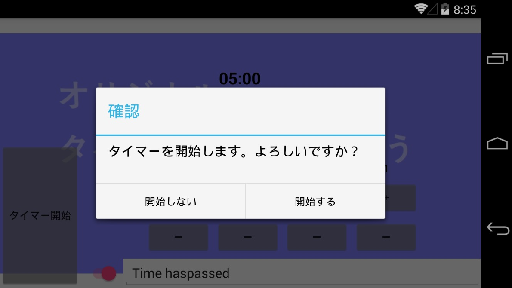

# メッセージング
ViewModel は View を参照しないことが理想です。  
しかし、処理の結果などをデータバインディングでは実現できない形で View に反映したいことがあります。例えば

- メッセージダイアログの表示
- 問い合わせダイアログの表示
- 画面遷移

などが代表例です。これらは、メッセージングで実現します。  

## メッセージング概要
メッセージングは処理を起動する側がメッセージ管理者へメッセージ送信を依頼し、メッセージ管理者はメッセージの購読をメッセージ管理者へ登録している購読者へメッセージを送信します。  
これによりメッセージの送信側とメッセージの購読側の関係が疎に保たれます。  

## 今回の方針
今回はメッセージングは、ViewModel と View の接続のうちデータバインディングでは実現が難しい要素

- 問い合わせダイアログの表示
- 画面遷移

の場面で利用します。  

## メッセージの送信
```MessagingCenter``` クラスの ```Send``` メソッドによりメッセージを送信します。  
3 つ目の引数には購読側へ渡すパラメーターを設定できます。今回はダイアログに表示するメッセージなどを設定します。
```cs
MessagingCenter.Send(this, "DisplayAlert", alertParameter);
```

## メッセージの購読
```MessagingCenter``` クラスの ```Subscribe``` メソッドによりメッセージを購読します。  
3 つ目の引数にはメッセージを受信した際に呼び出されるメソッドを設定します。
```cs
MessagingCenter.Subscribe<MainPageViewModel, AlertParameter>(this, "DisplayAlert", DisplayAlert);
```
また、メッセージの購読は購読者を ```MessagingCenter``` へ登録しますので、必要がなくなったら登録を解除しなければなりません。
```cs
MessagingCenter.Unsubscribe<MainPageViewModel, AlertParameter>(this, "DisplayAlert");
```

## パラメータークラスの作成
```MyTimer``` プロジェクト (共有コードプロジェクト) に ```AlertParameter``` クラスを作成します。  
クラスの作成方法は [背景画像の表示](./textbook03.md) で学んでいます。思い出しながら作成してください。  

パラメーター用のクラスは渡す値をプロパティとして持ったプレーンなクラスです (Plain Old CLR Object・POCO とも呼ばれる) 。
今回は次のコードで ```AlertParameter.cs``` ファイルの内容を上書きしてください。
```cs
using System;
using System.Collections.Generic;
using System.Text;

namespace MyTimer
{
    // アラートダイアログ表示メッセージのパラメーター
    class AlertParameter
    {
        // 表示するアラートダイアログのタイトルを取得または設定する
        public string Title { get; set; }
        // 表示するアラートダイアログのメッセージを取得または設定する
        public string Message { get; set; }
        // 表示するアラートダイアログの OK ボタンのテキストを取得または設定する
        public string Accept { get; set; }
        // 表示するアラートダイアログのキャンセルボタンのテキストを取得または設定する
        public string Cancel { get; set; }
        // 表示するアラートダイアログの選択時に呼ばれる処理を取得または設定する
        public Action<bool> Action { get; set; }
    }
}
```

## 問い合わせダイアログの表示（メッセージ送信）
開始ボタンがタップされた際に本当に開始するかを確認するダイアログを表示します。  
ボタンがタップされたことによる処理は ViewModel に作成しますが、ダイアログの表示は View に作成します。このため、ViewModel から View へダイアログの表示を依頼しなければなりません。  
そこで、メッセージングの出番です。ViewModel からのメッセージ送信を作成します。  

```MainPageViewModel.cs``` の ```Start``` メソッドを次のように変更します。  

**・変更前**
```cs
// 開始ボタンが押された際の処理
private void Start()
{
}
```

**・変更後**
```cs
// 開始ボタンが押された際の処理
private void Start()
{
    // タイマーを実行してよいかを問い合わせる Alert メッセージの設定
    var alertParameter = new AlertParameter()
    {
        Title = "確認",
        Message = "タイマーを開始します。よろしいですか？",
        Accept = "開始する",
        Cancel = "開始しない",

        // アラートメッセージで「開始する/開始しない」選択後の処理
        Action = result =>
        {
            // 「開始する」の場合、タイマーのカウント画面へ移動するようメッセージを送信
            if (result)
                MessagingCenter.Send(this, "Start");
        }
    };

    // アラートメッセージを表示するようメッセージを送信
    MessagingCenter.Send(this, "DisplayAlert", alertParameter);
}
```

## 問い合わせダイアログの表示（メッセージ購読の登録）
View 側でメッセージの購読を登録します。  
メッセージは画面が表示されている間だけ購読し、画面が表示されなくなったら購読を解除します。  
購読の登録と解除は、View の ```Appearing``` イベントで登録を、```Disappearing``` イベントで解除を行います。  

**・View へのイベントハンドラの登録**  
```MainPage.xaml``` の ```ContentPage``` 要素の属性に次のコードを追加します。
```xml
Appearing="MainPageAppearing"
Disappearing="MainPageDisappearing"
```
追加後の ```ContentPage``` 要素の属性は次のようになります。
```xml
<ContentPage xmlns="http://xamarin.com/schemas/2014/forms"
             xmlns:x="http://schemas.microsoft.com/winfx/2009/xaml"
             xmlns:local="clr-namespace:MyTimer"
             x:Class="MyTimer.MainPage"
             xmlns:vm="clr-namespace:MyTimer"
             Appearing="MainPageAppearing"
             Disappearing="MainPageDisappearing"
             Title="オリジナルタイマーアプリ">
```

**・コードビハインドでのイベントハンドラの追加**  
View のコードビハインドに ```Appearing``` イベントと ```Disappearing``` イベントのハンドラメソッドを追加します。  
コードビハインドにはなるべくコードを書かないことが望ましいですが、そのためにはいくつかのライブラリを利用する必要があります。今回はなるべくライブラリの追加をしない素の Xamarin.Forms で作りますので、多少はコードビハインドへの記述が必要になります。  

```MainPage.xaml.cs``` の ```MainPage``` クラスに次のメソッドを追加します。
```cs
// 画面が表示されたタイミングでの処理
private void MainPageAppearing(object sender, EventArgs e)
{
    // メッセージの購読を設定する
    // アラートダイアログ表示メッセージを購読する
    MessagingCenter.Subscribe<MainPageViewModel, AlertParameter>(this, "DisplayAlert", DisplayAlert);
    // タイマースタートのメッセージを購読する
    MessagingCenter.Subscribe<MainPageViewModel>(this, "Start", StartTimer);
}

// 画面が表示されなくなったタイミングでの処理
private void MainPageDisappearing(object sender, EventArgs e)
{
    // メッセージの購読を解除する
    MessagingCenter.Unsubscribe<MainPageViewModel, AlertParameter>(this, "DisplayAlert");
    MessagingCenter.Unsubscribe<MainPageViewModel>(this, "Start");
}
```

**・メッセージ受信時の処理メソッドの追加**  
View のコードビハインドにメッセージ受信時の処理メソッドを追加します。  
```MainPage.xaml.cs``` の ```MainPage``` クラスに次のメソッドを追加します。
```cs
// アラートダイアログを表示する
 private async void DisplayAlert<T>(T sender, AlertParameter arg)
{
    // アラートダイアログを表示する
    var isAccept = await DisplayAlert(arg.Title, arg.Message, arg.Accept, arg.Cancel);
    // アラートダイアログでのユーザーの選択結果い応じた処理を実行する
    arg.Action?.Invoke(isAccept);
}

// タイマーをスタートする
private void StartTimer<T>(T sender)
{
}
```

ここまでの手順で現在の ```MainPageViewModel.cs``` は次のようになっています。  
```cs
using System;
using System.Collections.Generic;
using System.Text;
using Xamarin.Forms;

namespace MyTimer
{
    // 起動直後のタイマー設定画面の ViewModel
    class MainPageViewModel : BindableBase
    {
        // **画面の値とバインディングするプロパティ**

        // タイマー時間
        private TimeSpan _time = TimeSpan.FromMinutes(5);
        public TimeSpan Time { get { return _time; } set { SetProperty(ref _time, value); } }

        // タイマー時間経過後の案内音声
        private string _speechText = "Time haspassed";
        public string SpeechText { get { return _speechText; } set { SetProperty(ref _speechText, value); } }

        // タイマー時間経過後に案内音声を使うか？（使わない場合、Audio 再生）
        private bool _useSpeechText = true;
        public bool UseSpeechText { get { return _useSpeechText; } set { SetProperty(ref _useSpeechText, value); } }


        // **画面のボタンとバインディングするコマンド**

        // 開始ボタンが押された
        public Command StartCommand { get; }

        // 秒 +/- ボタンが押された
        public Command AddSecondsCommand { get; }

        // 分 +/- ボタンが押された
        public Command AddMinutesCommand { get; }


        // **複数個所で行われる処理をメソッド化したメソッド**

        // object (中身は string) を long に parse する
        private long ParseLong(object arg)
        {
            if (long.TryParse(arg?.ToString(), out var value))
                return value;
            return default(long);
        }

        // タイマー時間を追加する
        private void AddTime(long seconds)
        {
            var newTime = Time.TotalSeconds + seconds;

            // 必ず 1 秒以上 60 分未満となるよう調整する
            newTime = Math.Max(1, newTime);
            newTime = Math.Min((60 * 60) - 1, newTime);

            Time = TimeSpan.FromSeconds(newTime);
        }


        // **コマンドの中身となるボタンが押された際の処理メソッド**

        // 秒 +/- ボタンが押された際の処理
        private void AddSeconds(object parameter)
        {
            long value = ParseLong(parameter);
            AddTime(value);
        }

        // 分 +/- ボタンが押された際の処理
        private void AddMinutes(object parameter)
        {
            long value = ParseLong(parameter);
            AddTime(value * 60);
        }

        // 開始ボタンが押された際の処理
        private void Start()
        {
            // タイマーを実行してよいかを問い合わせる Alert メッセージの設定
            var alertParameter = new AlertParameter()
            {
                Title = "確認",
                Message = "タイマーを開始します。よろしいですか？",
                Accept = "開始する",
                Cancel = "開始しない",

                // アラートメッセージで「開始する/開始しない」選択後の処理
                Action = result =>
                {
                    // 「開始する」の場合、タイマーのカウント画面へ移動するようメッセージを送信
                    if (result)
                        MessagingCenter.Send(this, "Start");
                }
            };

            // アラートメッセージを表示するようメッセージを送信
            MessagingCenter.Send(this, "DisplayAlert", alertParameter);
        }

        // **コンストラクタ**

        // コンストラクタ
        public MainPageViewModel()
        {
            // コマンドの設定
            // readonly プロパティの初期化は、コンストラクタ内でも行える
            AddSecondsCommand = new Command(AddSeconds);
            AddMinutesCommand = new Command(AddMinutes);
            StartCommand = new Command(Start);
        }
    }
}
```

現在の ```MainPage.xaml``` は次のようになっています。
```xml
<?xml version="1.0" encoding="utf-8" ?>
<ContentPage xmlns="http://xamarin.com/schemas/2014/forms"
             xmlns:x="http://schemas.microsoft.com/winfx/2009/xaml"
             xmlns:local="clr-namespace:MyTimer"
             x:Class="MyTimer.MainPage"
             xmlns:vm="clr-namespace:MyTimer"
             Appearing="MainPageAppearing"
             Disappearing="MainPageDisappearing"
             Title="オリジナルタイマーアプリ">
    <!-- ViewModel を設定、構築 -->
    <ContentPage.BindingContext>
        <vm:MainPageViewModel />
    </ContentPage.BindingContext>

    <!-- ページの表示内容 -->
    <ContentPage.Content>
        <Grid>
            <!-- 背景画像 -->
            <Image Source="{local:ImageResource MyTimer.Resources.Background.png}" Aspect="AspectFit" />

            <Grid BackgroundColor="#80FFFFFF">
                <Grid.RowDefinitions>
                    <RowDefinition Height="*"/>
                    <RowDefinition Height="Auto"/>
                    <RowDefinition Height="40"/>
                </Grid.RowDefinitions>
                <Grid.ColumnDefinitions>
                    <ColumnDefinition Width="Auto"/>
                    <ColumnDefinition Width="*"/>
                </Grid.ColumnDefinitions>

                <!-- 設定中のタイマー時間表示 -->
                <Label Text="{Binding Time, StringFormat='{0:mm\\:ss}'}"
                    Grid.ColumnSpan="2"
                    HorizontalOptions="Center" VerticalOptions="Center"
                    FontSize="Large" TextColor="Black" FontAttributes="Bold"/>

                <!-- タイマー開始ボタン -->
                <Button Text="タイマー開始" Command="{Binding StartCommand}" 
                    Grid.Row="1" Grid.RowSpan="2"
                    BackgroundColor="#80808080"/>

                <!-- タイマー時間の + - ボタン達 -->
                <StackLayout Orientation="Horizontal"
                    Grid.Row="1" Grid.Column="1"
                    HorizontalOptions="Center">
                    <!-- 分の + - ボタン達 -->
                    <StackLayout>
                        <!-- 「分」 ラベル -->
                        <Label Text="分" HorizontalOptions="Center" TextColor="Black" FontAttributes="Bold"/>
                        <!-- + - ボタン達  -->
                        <StackLayout Orientation="Horizontal">
                            <!-- 10の位設定 -->
                            <StackLayout>
                                <Label Text="10" HorizontalOptions="Center" TextColor="Black" FontAttributes="Bold"/>
                                <Button Text="＋" Command="{Binding AddMinutesCommand}" CommandParameter="10" BackgroundColor="#80808080"/>
                                <Button Text="ー" Command="{Binding AddMinutesCommand}" CommandParameter="-10" BackgroundColor="#80808080"/>
                            </StackLayout>
                            <!-- 1の位設定 -->
                            <StackLayout>
                                <Label Text="1" HorizontalOptions="Center" TextColor="Black" FontAttributes="Bold"/>
                                <Button Text="＋" Command="{Binding AddMinutesCommand}" CommandParameter="1" BackgroundColor="#80808080"/>
                                <Button Text="ー" Command="{Binding AddMinutesCommand}" CommandParameter="-1" BackgroundColor="#80808080"/>
                            </StackLayout>
                        </StackLayout>
                    </StackLayout>
                    <!-- 秒の + - ボタン達 -->
                    <StackLayout>
                        <!-- 「秒」 ラベル -->
                        <Label Text="秒" HorizontalOptions="Center" TextColor="Black" FontAttributes="Bold"/>
                        <!-- + - ボタン達  -->
                        <StackLayout Orientation="Horizontal">
                            <!-- 10の位設定 -->
                            <StackLayout>
                                <Label Text="10" HorizontalOptions="Center" TextColor="Black" FontAttributes="Bold"/>
                                <Button Text="＋" Command="{Binding AddSecondsCommand}" CommandParameter="10" BackgroundColor="#80808080"/>
                                <Button Text="ー" Command="{Binding AddSecondsCommand}" CommandParameter="-10" BackgroundColor="#80808080"/>
                            </StackLayout>
                            <!-- 1の位設定 -->
                            <StackLayout>
                                <Label Text="1" HorizontalOptions="Center" TextColor="Black" FontAttributes="Bold"/>
                                <Button Text="＋" Command="{Binding AddSecondsCommand}" CommandParameter="1" BackgroundColor="#80808080"/>
                                <Button Text="ー" Command="{Binding AddSecondsCommand}" CommandParameter="-1" BackgroundColor="#80808080"/>
                            </StackLayout>
                        </StackLayout>
                    </StackLayout>
                </StackLayout>

                <!-- カウント後の音声設定 -->
                <Grid Grid.Row="2" Grid.Column="1">
                    <Grid.ColumnDefinitions>
                        <ColumnDefinition Width="Auto"/>
                        <ColumnDefinition Width="*"/>
                    </Grid.ColumnDefinitions>
                    <!-- テキスト読み上げ or 音声ファイル の選択 Switch -->
                    <Switch x:Name="useSpeechText" IsToggled="{Binding UseSpeechText}" />
                    <Grid Grid.Column="1">
                        <!-- 音声ファイルを使用ラベル -->
                        <Label Text="音声ファイルを使用"
                            HorizontalOptions="Fill" VerticalOptions="Center" HorizontalTextAlignment="Start"
                            TextColor="Black" FontAttributes="Bold"/>
                        <!-- テキスト読み上げのテキスト -->
                        <Editor Text="{Binding SpeechText}"
                            HorizontalOptions="Fill"
                            IsVisible="{Binding IsToggled, Source={x:Reference useSpeechText}" BackgroundColor="White"/>
                    </Grid>
                </Grid>
            </Grid>
        </Grid>
    </ContentPage.Content>
</ContentPage>
```

現在の ```MainPage.xaml.cs``` は次のようになっています。
```cs
using System;
using System.Collections.Generic;
using System.Linq;
using System.Text;
using System.Threading.Tasks;
using Xamarin.Forms;

namespace MyTimer
{
    // 起動直後の画面。タイマー設定を行う画面
    public partial class MainPage : ContentPage
	{
        // コンストラクタ
        public MainPage()
		{
			InitializeComponent();
		}

        // 画面が表示されたタイミングでの処理
        private void MainPageAppearing(object sender, EventArgs e)
        {
            // メッセージの購読を設定する
            // アラートダイアログ表示メッセージを購読する
            MessagingCenter.Subscribe<MainPageViewModel, AlertParameter>(this, "DisplayAlert", DisplayAlert);
            // タイマースタートのメッセージを購読する
            MessagingCenter.Subscribe<MainPageViewModel>(this, "Start", StartTimer);
        }

        // 画面が表示されなくなったタイミングでの処理
        private void MainPageDisappearing(object sender, EventArgs e)
        {
            // メッセージの購読を解除する
            MessagingCenter.Unsubscribe<MainPageViewModel, AlertParameter>(this, "DisplayAlert");
            MessagingCenter.Unsubscribe<MainPageViewModel>(this, "Start");
        }

        // アラートダイアログを表示する
        private async void DisplayAlert<T>(T sender, AlertParameter arg)
        {
            // アラートダイアログを表示する
            var isAccept = await DisplayAlert(arg.Title, arg.Message, arg.Accept, arg.Cancel);
            // アラートダイアログでのユーザーの選択結果い応じた処理を実行する
            arg.Action?.Invoke(isAccept);
        }

        // タイマーをスタートする
        private void StartTimer<T>(T sender)
        {
        }

    }
}
```

## デバッグ実行
デバッグ実行をします。  
[タイマー開始] ボタンをタップし次のように表示されたらこのページは完了です。  

※OS や バージョンによって見た目は大きく異なります。

[< 前ページ](./textbook07.md) | [次ページ >](./textbook09.md)  