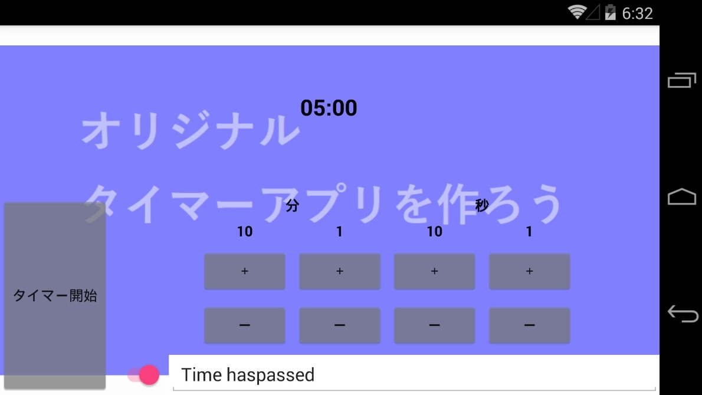
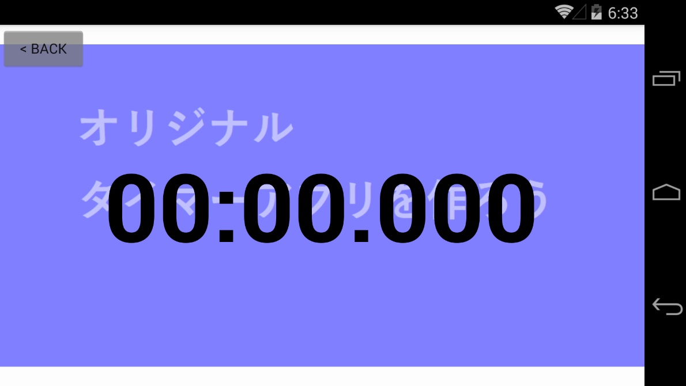

# タイマーページの作成
画面遷移後の画面を作成します。  
これまで作ってきた MainPage と同様に、xaml、xaml.cs による View および ViewModel クラスを作成します。  

## View の作成
CountDownPage ビュークラスを作成します。  

```MyTimer``` プロジェクト(共有コードプロジェクト)に ```CountDownPage``` クラスを作成します。  
クラスの作成方法は [背景画像の表示](./textbook03.md) で学んでいます。今回は少し違う部分がありますが、基本的な流れは同じです。思い出しながら作成してください。  
  
**Mac の場合**  
・ソリューションエクスプローラー上の [MyTimer] 上で二本指タップ (右クリック) します。  
・[追加 > 新しいファイル] を選択します。  
・[新しいファイル] ウィンドウで [Forms > Forms ContentPage Xaml] を選択します。  
・[名前:] に ```CountDownPage``` と入力します  
・[新規] をクリックします。  

**Windows の場合**  
・ソリューションエクスプローラー上の [MyTimer] 上で二本指タップ (右クリック) します。  
・[追加 > 新しい項目] を選択します。  
・[新しい項目の追加 - MyTimer] ウィンドウの左のペインで [インストール済み > Visual C# アイテム > Xamarin.Forms] を選択します。  
・右のペインで [ContentPage] を選択します。  
・[名前:] に ```CountDownPage``` と入力します。  
・[追加] をクリックします。

## ViewModel の作成
```MyTimer``` プロジェクト (共有コードプロジェクト) に ```CountDownPageViewModel``` クラスを作成します。  
クラスの作成方法は [背景画像の表示](./textbook03.md) で学んでいます。思い出しながら作成してください。  

## 現在のカウントのデータバインディング
カウント画面の現在のカウント (カウントダウン表示) をデータバインディングします。  
カウント中の残り時間は ViewModel のプロパティとして保持します。表示は View になります。  
データバインディングについては [データバインディング](./textbook07.md) で学んでいます。思い出しながら次のコードで  View、ViewModel それぞれを上書きしてください。

**・CountDownPageViewModel.cs**
```cs
using System;
using System.Collections.Generic;
using System.Linq;
using System.Text;
using Xamarin.Forms;

namespace MyTimer
{
    // タイマーカウント画面の ViewModel
    class CountDownPageViewModel : BindableBase
    {
        // カウントの残り時間
        private TimeSpan _time;
        public TimeSpan Time
        {
            get { return _time; }
            private set { SetProperty(ref _time, value); }
        }
    }
}
```

**・CountDownPage.xaml**
```xml
<?xml version="1.0" encoding="utf-8" ?>
<ContentPage xmlns="http://xamarin.com/schemas/2014/forms"
             xmlns:x="http://schemas.microsoft.com/winfx/2009/xaml"
             xmlns:local="clr-namespace:MyTimer"
             x:Class="MyTimer.CountDownPage"
             xmlns:vm="clr-namespace:MyTimer"
             Title="カウントダウン">
    <!-- ViewModel を設定、構築 -->
    <ContentPage.BindingContext>
        <vm:CountDownPageViewModel/>
    </ContentPage.BindingContext>
    <!-- ページの表示内容 -->
    <ContentPage.Content>
        <Grid>
            <!-- 背景画像 -->
            <Image Source="{local:ImageResource MyTimer.Resources.Background.png}" Aspect="AspectFit" />
            <!-- 文字が背景に埋もれないよう、背景画像に半透明色を乗せる -->
            <Grid BackgroundColor="#80FFFFFF"/>

            <!-- 残り時間の表示 -->
            <Label Text="{Binding Time, StringFormat='{0:mm\\:ss\\.fff}'}"
                HorizontalOptions="Center" VerticalOptions="Center"
                FontSize="96" TextColor="Black" FontAttributes="Bold"/>
            <!-- Back ボタン -->
            <Button Text=" &lt; Back "
                HorizontalOptions="Start" VerticalOptions="Start"
                BackgroundColor="#80808080"/>
        </Grid>
    </ContentPage.Content>
</ContentPage>

```

## 戻る遷移
カウント画面からタイマー設定画面 (メイン画面・最初の画面) に戻る処理は、タイマーをスタートした時と同様に、Viewに記述します。  
ページを戻るには ```Navigation``` オブジェクトの ```Pop～``` メソッドを呼び出します。```Pop～``` メソッドは複数ありますが、このページへの遷移をするときの ```Push～``` と対になるものを使えば OK です。  
今回は ```PushModalAsync``` メソッドで遷移したので ```PopModalAsync``` でを使用します。
```cs
// タイマー設定画面へ遷移する
this.Navigation.PopModalAsync();
```
また、View へ遷移した時と同様に戻る処理も View に記述します。そのため今回もメッセージングを使用します。メッセージングについては [メッセージング](./textbook08.md) で、 画面遷移については [画面遷移](./textbook09.md) で学んでいます。思い出しながら次のコードで View、ViewModel のコードを上書きしてください。

**・CountDownPageViewModel.cs**
```cs
using System;
using System.Collections.Generic;
using System.Linq;
using System.Text;
using Xamarin.Forms;

namespace MyTimer
{
    // タイマーカウント画面の ViewModel
    class CountDownPageViewModel : BindableBase
    {
        // カウントの残り時間
        private TimeSpan _time;
        public TimeSpan Time
        {
            get { return _time; }
            private set { SetProperty(ref _time, value); }
        }

        // 戻るボタンが押された
        public Command GoBackCommand { get; }

        // 画面を閉じ、カウント設定画面へ戻る
        private void GoBack()
        {
            // 画面を「戻る」メッセージを送信
            MessagingCenter.Send(this, "GoBack");
        }

        // コンストラクタ
        public CountDownPageViewModel()
        {
            // コマンドの設定
            // readonly プロパティの初期化は、コンストラクタ内でも行える
            GoBackCommand = new Command(GoBack);
        }
    }
}
```

**・CountDownPage.cs**
```cs
using System;
using System.Collections.Generic;
using System.Linq;
using System.Text;
using System.Threading.Tasks;

using Xamarin.Forms;
using Xamarin.Forms.Xaml;

namespace MyTimer
{
    // タイマーカウントダウン画面
	[XamlCompilation(XamlCompilationOptions.Compile)]
	public partial class CountDownPage : ContentPage
	{
        // コンストラクタ
		public CountDownPage ()
		{
			InitializeComponent ();
        }

        // 画面が表示されたタイミングでの処理
        private void CountDownPageAppearing(object sender, EventArgs e)
        {
            // 戻るメッセージを購読する
            MessagingCenter.Subscribe<CountDownPageViewModel>(this, "GoBack", GoBack);
        }

        // 画面が表示されなくなったタイミングでの処理
        private void CountDownPageDisappearing(object sender, EventArgs e)
        {
            // メッセージの購読を解除する
            MessagingCenter.Unsubscribe<CountDownPageViewModel>(this, "GoBack");
        }

        // 画面を閉じ、タイマー設定画面へ戻る
        private void GoBack<T>(T sender)
        {
            // タイマー設定画面へ遷移する
            this.Navigation.PopModalAsync();
        }
    }
}
```
**・CountDownPage.xaml.cs**
```xml
<?xml version="1.0" encoding="utf-8" ?>
<ContentPage xmlns="http://xamarin.com/schemas/2014/forms"
             xmlns:x="http://schemas.microsoft.com/winfx/2009/xaml"
             xmlns:local="clr-namespace:MyTimer"
             x:Class="MyTimer.CountDownPage"
             xmlns:vm="clr-namespace:MyTimer"
             Appearing="CountDownPageAppearing"
             Disappearing="CountDownPageDisappearing"
             Title="カウントダウン">
    <!-- ViewModel を設定、構築 -->
    <ContentPage.BindingContext>
        <vm:CountDownPageViewModel/>
    </ContentPage.BindingContext>
    <!-- ページの表示内容 -->
    <ContentPage.Content>
        <Grid>
            <!-- 背景画像 -->
            <Image Source="{local:ImageResource MyTimer.Resources.Background.png}" Aspect="AspectFit" />
            <!-- 文字が背景に埋もれないよう、背景画像に半透明色を乗せる -->
            <Grid BackgroundColor="#80FFFFFF"/>

            <!-- 残り時間の表示 -->
            <Label Text="{Binding Time, StringFormat='{0:mm\\:ss\\.fff}'}"
                HorizontalOptions="Center" VerticalOptions="Center"
                FontSize="96" TextColor="Black" FontAttributes="Bold"/>
            <!-- Back ボタン -->
            <Button Text=" &lt; Back " Command="{Binding GoBackCommand}"
                HorizontalOptions="Start" VerticalOptions="Start"
                BackgroundColor="#80808080"/>
        </Grid>
    </ContentPage.Content>
</ContentPage>
```

## 確認
デバッグ実行し、[タイマー開始] で二つ目の View に遷移し、[< Back] で一つ目の画面に戻れたらこのステップは完了です。  

**・一つ目の View**  


**・二つ目のView**  


[< 前ページ](./textbook09.md) | [次ページ >](./textbook11.md)  