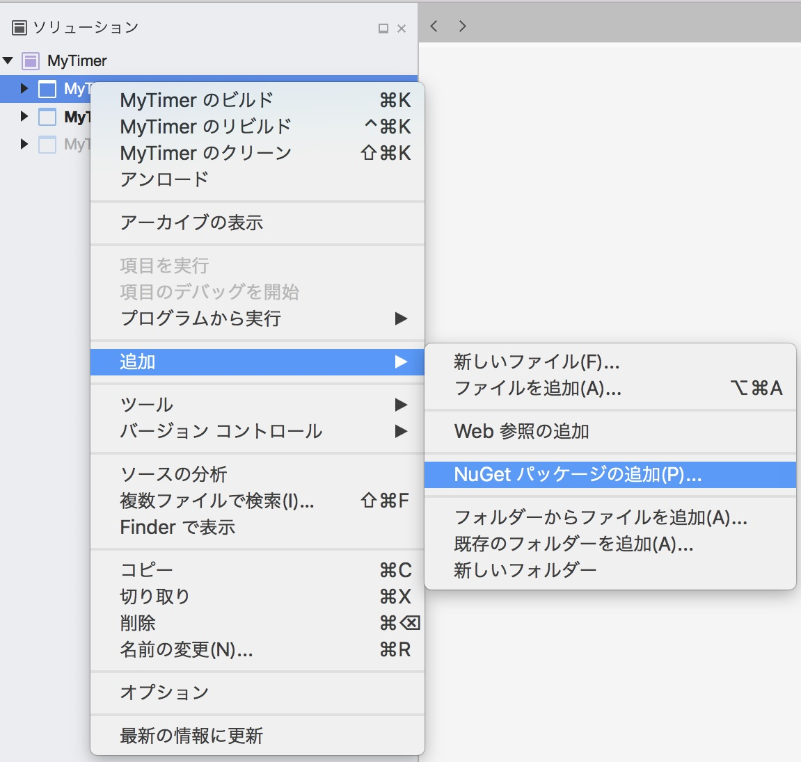
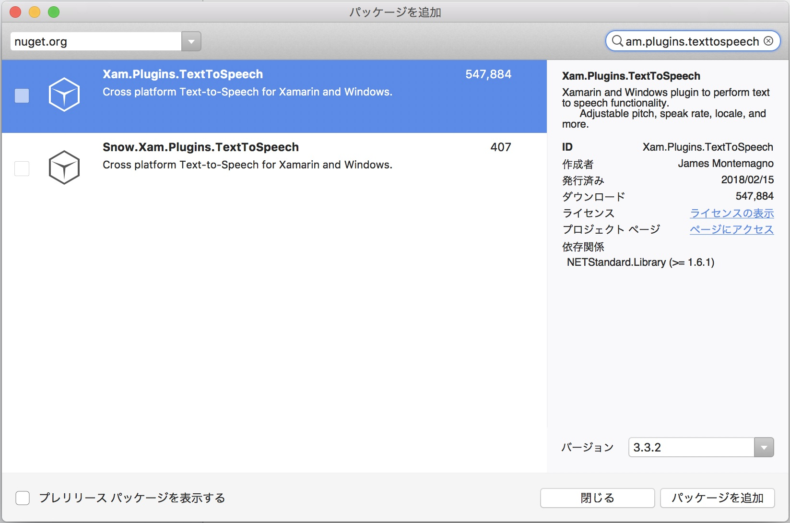
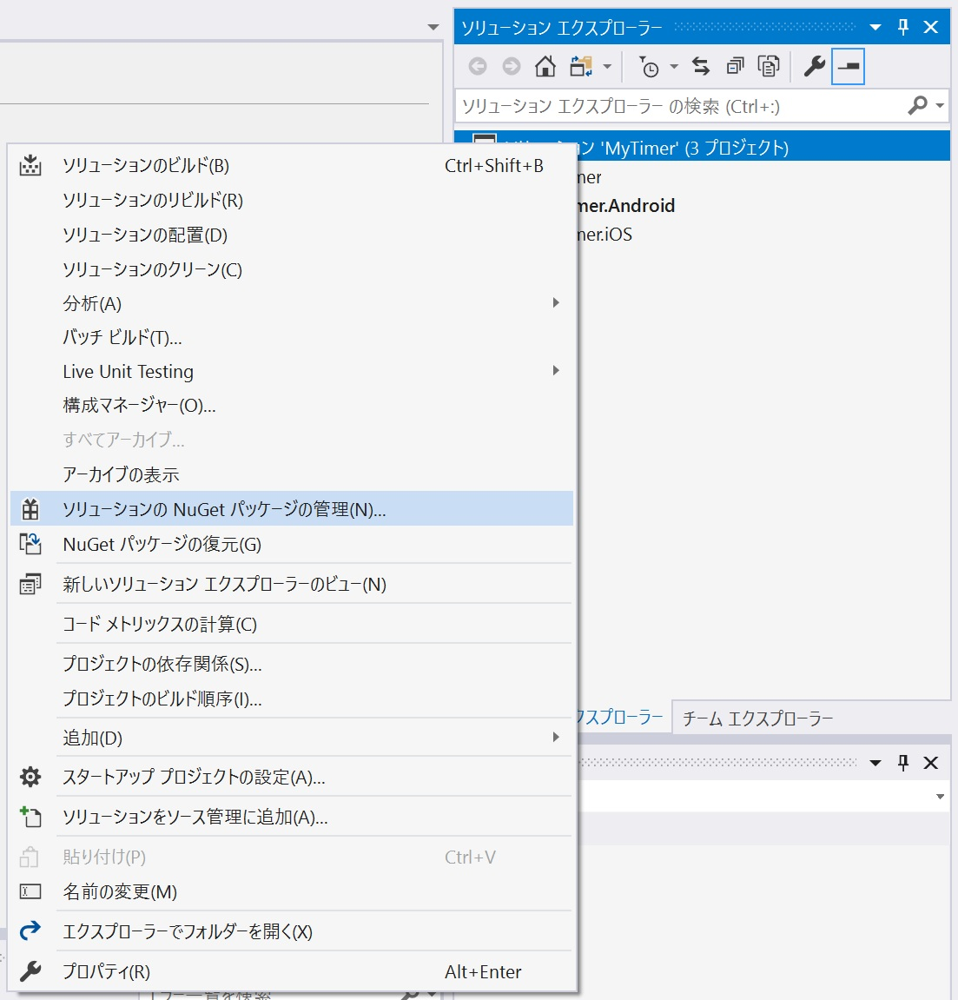

# TextToSpeech
タイマー設定時間の経過を音声で知らせる機能を実装します。  
スマートデバイスに設定したテキストをしゃべらせる機能は、プラットフォーム毎の機能になり Xamarin.Forms の機能にはありません。前述の DependencyService を利用することで自身で実装することもできますが、今回は NuGet からライブラリを取得し利用します。

## NuGet の概要
パッケージ管理のサービスです。  
世界中の開発者が多くのライブラリを登録してくれています。今回のテキストをしゃべる機能のように、良く使いそうな機能の多くは NuGet 上でライブラリが見つかります。  
今回利用する TextToSpeech もその一つです。作者に感謝しながらプロジェクトに追加しましょう。  

## TextToSpeech の追加 (Mac の場合)
・ソリューションエクスプローラー上の [MyTimer] プロジェクト上で二本指タップ (右クリック) します。  
・[追加 > NuGet パッケージの追加] を選択します。  


・検索ボックスに ```xam.plugins.texttospeech``` と入力します。  
・検索結果欄で Xam.Plugins.TextToSpeech を選択します。  
・[パッケージを追加] ボタンをクリックします。


・[ライセンスの同意] ダイアログで [同意する] をクリックします。  
  
**同様の手順で、[MyTimer.Droid]、[MyTimer.iOS] プロジェクトにもパッケージを追加します。**

## TextToSpeech の追加 (Windows の場合)
・ソリューションエクスプローラー上の [MyTimer] 上で二本指タップ (右クリック) します。  
**※プロジェクトではなくソリューションを二本指タップ (右クリック) することに注意してください**  
・[ソリューションの NuGet パッケージの管理] を選択します。  


・[参照] タブを選択します。  
・検索ボックスに ```xam.plugins.texttospeech``` と入力します。  
・検索結果欄で Xam.Plugins.TextToSpeech を選択します。  
・右ペインのチェックボックスを全て (**[MyTimer]** **[MyTimer\MyTimer.Android～]** **[MyTimer\MyTimer.iOS～]**) ON にします。  
・[インストール] ボタンをクリックします。


・[変更のプレビュー] ダイアログで [OK] ボタンをクリックします。

## TextToSpeech の利用
TextToSpeech を利用するには、```Plugin.TextToSpeech.CrossTextToSpeech``` クラスの static プロパティ ```Current``` で取得できるオブジェクトの ```Speak``` メソッドを実行するだけです。しゃべるテキストはメソッドの引数で指定します。  
今回のしゃべるテキストは、全画面から渡されたパラメーターの中に含まれています。

```CountDownPageViewModel``` クラスの ```TextToSpeech``` メソッドを次のコードで上書きしてください。
```cs
// テキストの読み上げ
private async void TextToSpeech()
{
    await Plugin.TextToSpeech.CrossTextToSpeech.Current.Speak(TimerSettings.Instance.SpeechText, volume:0.5f);
}
```

[< 前ページ](./textbook13.md) | [次ページ >](./textbook15.md)  